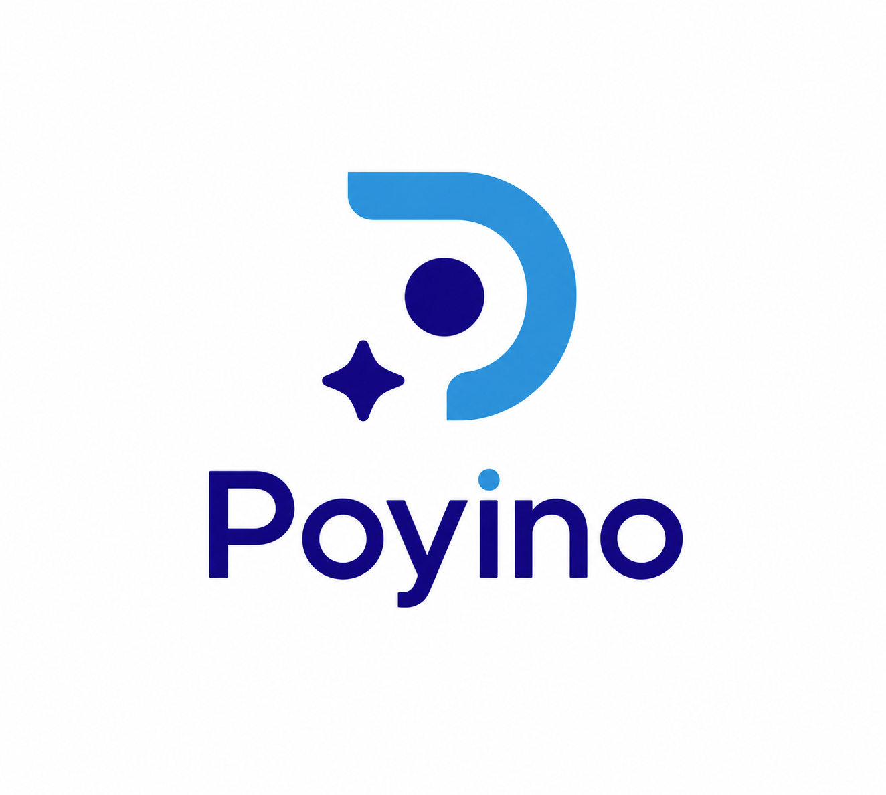

# Poyino

> AI-powered recruitment platform that helps organizations discover, evaluate, and hire the best talent.

---

## Vision

Poyino is building an intelligent hiring platform that enables organizations to publish a single job opening and collect, analyze, rank, and manage candidates from everywhere using AI.

---

## MVP

Current focus:

- Organization management
- Job posting
- Public application page
- AI resume parsing
- Candidate ranking
- Hiring pipeline

---

## Documentation

docs/

- Vision
- Roadmap
- Features
- UI/UX
- Architecture
- API
- Database
- Specifications

---

## Development Workflow

Sketch

↓

Wireframe

↓

UI Design

↓

Design System

↓

Storybook

↓

Technical Specification

↓

Development

---

## Repository Structure

...